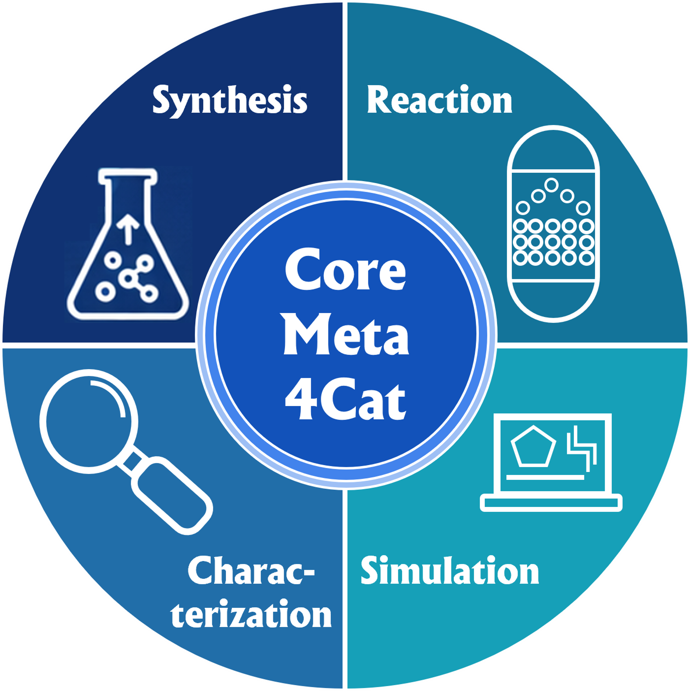

# Design Patterns

This page explains the key structural decisions behind CoreMeta4Cat — how the four pillars are modelled, how they connect to a dataset, and what design patterns make the schema extensible and machine-actionable.

<div style="text-align: center;">
    <a>
    
    </a>
</div>
---

## Reading guide

This page is written in three tiers. Most users only need the first two.

| Tier | Who it's for | Sections |
|---|---|---|
| **Overview** | Everyone — data providers, repository managers | [The entry point](#the-entry-point-catalysisdataset), [The four pillars](#the-four-pillars) |
| **Pattern explanations** | Users who want to understand how to navigate or extend the schema | [Classification pattern](#pattern-1-classification-via-rdf_type), [Activity pattern](#pattern-2-activities-and-plans), [Mixin pattern](#pattern-3-mixin-classes) |
| **Technical depth** | Schema developers and DCAT-AP-PLUS integrators | [Sections marked with 🔬](#deep-dive-the-evaluatedactivity-distinction) |

---

## The entry point: CatalysisDataset

Every CoreMeta4Cat record starts with a **`CatalysisDataset`**. This is a `dcat:Dataset` — fully compatible with plain DCAT and DCAT-AP — extended with four additional link slots that connect to the four CoreMeta4Cat pillars.

```yaml
id: ex:dataset-001
type: CatalysisDataset                  # → dcat:Dataset

# Layer 1: global classification
rdf_type:
  id: voc4cat:0007001
  title: "heterogeneous catalysis"

# Layer 2: links to the four pillars
was_generated_by:
  - id: ex:synthesis-001
    type: Synthesis
  - id: ex:characterization-001
    type: Characterization

is_about_activity:
  - id: ex:reaction-001
    type: Reaction

is_about_entity:
  - id: ex:catalyst-001
    type: CatalystSample
```

The key points here are:

- `rdf_type` carries a **controlled vocabulary term** from [Voc4Cat](https://nfdi4cat.github.io/voc4cat/) to classify which field of catalysis the dataset belongs to.
- `was_generated_by` links to **activities that produced the data** (Synthesis, Characterization, Simulation).
- `is_about_activity` links to the **Reaction being studied** — which is the catalytic process itself, not a data-generating step.
- `is_about_entity` links to the **catalyst sample or material** the dataset concerns.

---

## The four pillars

The four CoreMeta4Cat pillars — **Synthesis**, **Characterization**, **Reaction**, and **Simulation** — are the core of the metadata model. Each is a separate class, defined in its own subprofile module, and linked from the `CatalysisDataset` via the slots above.

```
coremeta4cat.yaml  (aggregator + CatalysisDataset)
  ├── coremeta4cat_common.yaml          (shared slots and enumerations)
  ├── coremeta4cat_synthesis_ap.yaml    (Synthesis + 12 preparation methods)
  ├── coremeta4cat_characterization_ap.yaml  (Characterization + 28 techniques)
  ├── coremeta4cat_reaction_ap.yaml     (Reaction + 8 reactor types)
  └── coremeta4cat_simulation_ap.yaml   (Simulation + 4 methods + 12 properties)
```

### Synthesis

**What it is:** The process of preparing a catalyst. Synthesis is a `DataGeneratingActivity` — it produces data *about* the preparation, and it produces a `CatalystSample` as its physical output.

**Key links:**

- `realized_plan` → a `PreparationMethod` subclass (the protocol used)
- `had_input_entity` → `Precursor` instances (the starting materials)
- `had_output_entity` → `CatalystSample` (the resulting catalyst)

**Twelve preparation methods** are currently defined, each as a concrete `PreparationMethod` subclass:

<div class="grid cards" markdown>

-   **Wet chemistry**

    Impregnation, Co-Precipitation, Deposition-Precipitation, Sol-Gel, Molecular Synthesis

-   **Thermal / gas-phase**

    Solvothermal, Combustion Synthesis, Flame Spray Pyrolysis, Sublimation, Plasma-Assisted

-   **Mechanical / energy-assisted**

    Mechanochemical Synthesis, Microwave-Assisted, Sonochemical Synthesis

-   **Surface / thin-film**

    Atomic Layer Deposition, Exsolution Synthesis

</div>

### Characterization

**What it is:** The measurement of a catalyst or catalytic system using an analytical technique. Characterization is also a `DataGeneratingActivity` — it produces measurement data.

**Key links:**

- `evaluated_entity` → the `CatalystSample` or material being measured
- `realized_plan` → a `CharacterizationTechnique` subclass (the measurement protocol)
- `carried_out_by` → the instrument (`Device`) performing the measurement

**Twenty-eight techniques** are currently defined, organised into groups:

| Group | Techniques |
|---|---|
| Diffraction | Powder XRD, Single Crystal XRD |
| X-ray spectroscopy | XAS/XANES/EXAFS, XPS, EDX |
| Vibrational spectroscopy | FTIR, DRIFTS, Raman, NMR |
| Electron microscopy | TEM, SEM |
| Thermal analysis | TGA, TPR, TPO |
| Surface & pore analysis | BET |
| Elemental analysis | ICP-AES, Elemental Analysis (CHNS) |
| Optical & electronic | UV-Vis, Photoluminescence, Photoluminescence Lifetime |
| Electrochemistry | Cyclic Voltammetry, Conductivity Measurement |
| Particle sizing | Dynamic Light Scattering |
| Mass spectrometry | ESI-MS, GC-MS, HPLC-MS |
| Chromatography | GC, HPLC |

### Reaction

**What it is:** The catalytic reaction being studied. Unlike Synthesis and Characterization, Reaction is **not** a `DataGeneratingActivity`. It is the process being *observed*, not the process generating the dataset. In the schema it's named `CatalyticReaction`, and it specializes chemdcat-ap's generic `ChemicalReaction` -- see [Pattern 5: Specializing chemdcat-ap](#pattern-5-specializing-chemdcat-ap-inheritance) below for what that means in practice.

**Key links:**

- `used_reactor` (`is_a: carried_out_by`) → a `ChemicalReactor` (the physical reactor)
- `used_reactant` (`is_a: had_input_entity`) → the reactant feeds
- `product_identification_method` → a `CharacterizationTechnique` used for product analysis

**Eight reactor design types** are defined, all specializing chemdcat-ap's generic `Reactor` class via the abstract `ChemicalReactor`:

`FixedBedReactor` · `CSTR` · `PlugFlowReactor` · `Autoclave` · `SlurryReactor` · `Microreactor` · `ElectrochemicalReactor` · `FluidizedBedReactor`

!!! info "Operando experiments"
    For in-situ or operando experiments (e.g. XRD measured while a reaction runs), the dataset carries **both** links simultaneously:
    ```yaml
    was_generated_by:
      - type: Characterization     # PowderXRD — the process that made the data
    is_about_activity:
      - type: Reaction             # the catalytic process being monitored
    ```

### Simulation

**What it is:** A computational study of a catalyst or catalytic mechanism. Simulation is a `DataGeneratingActivity` — it generates data computationally.

**Key links:**

- `realized_plan` → a `SimulationMethod` subclass (DFT, MD, Microkinetics, MonteCarlo)
- `carried_out_by` → a `Software` agent (the simulation package)
- `evaluated_entity` → the catalyst model or structure being simulated

**Twelve calculated property classes** capture the type of computed output: `ElectronicStructure`, `BandGap`, `ThermodynamicStability`, `PhononDispersion`, `Surfaces`, `GrainBoundaries`, `ElasticConstants`, `DielectricTensors`, `EquationsOfState`, `AqueousStability`, `Piezoelectricity`, `Ferroelectrics`.

---

## Pattern 1: Classification via rdf_type

!!! abstract "Pattern summary"
    Flexible, machine-actionable classification of datasets, activities, and entities using ontology terms — without creating a separate class for every possible value.

Rather than defining a fixed class hierarchy for every type of catalysis or every synthesis method, CoreMeta4Cat uses a single `rdf_type` slot on each class to carry a controlled vocabulary term from Voc4Cat, CHMO, or another ontology. This keeps the schema compact while staying fully machine-actionable.

**On CatalysisDataset** — classify the catalysis research field:

```yaml
rdf_type:
  id: VOC4CAT:0007001
  title: "heterogeneous catalysis"
```

**On Synthesis** — classify the preparation method type:

```yaml
type: Synthesis
rdf_type:
  id: voc4cat:0007016
  title: "impregnation"
realized_plan:
  type: Impregnation    # the concrete method class with all parameter slots
```

**On Characterization** — classify the measurement technique:

```yaml
type: Characterization
rdf_type:
  id: CHMO:0000158
  title: "powder X-ray diffraction"
realized_plan:
  type: PowderXRD       # the concrete technique class with all measurement slots
```

The `rdf_type` slot gives the machine-readable ontology term; the concrete subclass (`Impregnation`, `PowderXRD`, …) provides the structured parameter slots. Both are used together.

The allowed values for `rdf_type` on `CatalysisDataset` are defined in `CatalysisResearchFieldEnum` -- see the [CatalysisDataset](catalysis-dataset.md) page for the full value table and a worked example combining multiple pillars into one dataset.

---

## Pattern 2: Activities and Plans

!!! abstract "Pattern summary"
    A two-part structure separates *what was done* (the Activity) from *the protocol describing how to do it* (the Plan). This mirrors the PROV-O model and keeps the schema clean.

Each pillar that generates data follows this two-part structure:

```
Activity (what was done)        Plan (the protocol)
─────────────────────────       ───────────────────────────
Synthesis              ──→      PreparationMethod
Characterization       ──→      CharacterizationTechnique
Simulation             ──→      SimulationMethod
```

The Activity carries the **instance-level data** (who did it, when, on what sample, with what output). The Plan carries the **method-level data** (parameter settings, instrument configuration, protocol steps).

```yaml
# The activity — what happened
id: ex:synthesis-001
type: Synthesis
nominal_composition: "5wt% Ni/Al2O3"
had_input_entity:
  - id: ex:precursor-001
    type: Precursor
    name: "Ni(NO3)2·6H2O"
    precursor_quantity: 1.24   # g
had_output_entity:
  - id: ex:catalyst-001
    type: CatalystSample

# The plan — the protocol
realized_plan:
  id: ex:method-001
  type: Impregnation
  impregnation_type: incipient_wetness
  impregnation_duration: 12.0   # h
  drying_temperature: 120.0     # °C
  drying_time: 12.0             # h
  calcination_final_temperature: 500.0   # °C
  calcination_dwelling_time: 4.0         # h
  calcination_gaseous_environment: "air"
```

This separation means a single `PreparationMethod` record could in principle be shared across multiple `Synthesis` activities — a direct gain for reproducibility. That sharing depends on the Plan being independently identifiable, which is why `realized_plan.id` is populated above.

`Plan` (external, DCAT-AP-PLUS) only carries `title`/`description` — no `id`. Rather than repeat an `id` slot on each of `PreparationMethod`, `CharacterizationTechnique`, `SimulationMethod`, and `ProductIdentificationMethod` individually, CoreMeta4Cat inserts one shared intermediate class, `CatalysisPlan` (`is_a: Plan`, abstract), that adds `id` once; all four then specialize `CatalysisPlan` instead of `Plan` directly. `realized_plan` itself needed `inlined: true` added explicitly on each of its class-level overrides (on `Synthesis`, `Characterization`, `Simulation`) once its range became identifier-bearing — LinkML's default for a single-valued, class-typed slot switches from "inline the whole object" to "reference by id" the moment the range class gains an identifier slot, unless told otherwise.

!!! note "A LinkML JSON Schema quirk worth knowing"
    Slots marked `recommended: true` (not `required: true`) still show up in the generated JSON Schema's `required` array — `gen-json-schema` has no native "recommended" tier to fall back to, so it folds recommended into required rather than dropping the distinction. In practice this means every Recommended field on a class needs a value for an instance to validate via `linkml-run-examples` (or any other JSON-Schema-based validator), not just Mandatory ones.

---

## Pattern 3: Mixin classes

!!! abstract "Pattern summary"
    Slot groups that are shared across multiple methods are factored into reusable mixin classes, so each slot is defined exactly once and inherited wherever needed.

Many preparation methods share common process steps — drying, calcination, precipitation. Rather than repeating the same slots in every method class, CoreMeta4Cat uses **mixin classes** that bundle related slots:

| Mixin | Slots it provides | Used by |
|---|---|---|
| `DryingMixin` | `drying_device`, `drying_temperature`, `drying_time`, `drying_atmosphere` | Impregnation, CoPrecipitation, DepositionPrecipitation, SonochemicalSynthesis, MolecularSynthesis |
| `CalcinationMixin` | `calcination_initial_temperature`, `calcination_final_temperature`, `calcination_dwelling_time`, `calcination_heating_rate`, `calcination_gaseous_environment`, `calcination_gas_flow_rate`, `number_of_cycles` | Impregnation, CoPrecipitation, DepositionPrecipitation, SonochemicalSynthesis, ExsolutionSynthesis |
| `PrecipitationMixin` | `precipitating_agent`, `synthesis_ph`, `mixing_rate`, `mixing_time`, `mixing_temperature`, `order_of_addition`, `aging_temperature`, `aging_time` | CoPrecipitation, DepositionPrecipitation |
| `ThermalSynthesisMixin` | `synthesis_temperature`, `synthesis_duration`, `equipment`, `vessel_type`, `atmosphere` | Solvothermal, PlasmaAssisted, CombustionSynthesis, MicrowaveAssisted, MechanochemicalSynthesis, Sublimation |

The same pattern is used in the **Characterization** subprofile for analytical techniques:

| Mixin | Used by |
|---|---|
| `XRaySourceMixin` | PowderXRD, SingleCrystalXRD, XPS, EDX |
| `ElectronMicroscopyMixin` | TEM, SEM |
| `TemperatureProgramMixin` | TPR, TPO, Thermogravimetry |
| `ChromatographyMixin` | GC, HPLC, GC-MS, HPLC-MS |
| `MassRangeMixin` | GC-MS, HPLC-MS, ESI-MS |
| `ElectrochemistryMixin` | CyclicVoltammetry, ConductivityMeasurement |

In LinkML, a mixin class has no `class_uri` of its own and generates no independent node shape. It is a pure slot container, mixed in via the `mixins:` key on a concrete class.

---

## Pattern 4: Shared slots in coremeta4cat_common

!!! abstract "Pattern summary"
    Slots referenced by two or more subprofiles are declared once in `coremeta4cat_common.yaml` and imported by all subprofiles. This keeps the schema DRY (Don't Repeat Yourself) -- but it also means editing one changes it everywhere it's used, not just in the context you had in mind. See the warning below.

Some slots appear in multiple pillars — for example, `has_atmosphere` is relevant to Synthesis (e.g. `MolecularSynthesis`), Characterization (e.g. `InfraredSpectroscopy`, `NMRSpectroscopy`), and Reaction (`CatalyticReaction`). These shared slots live in `coremeta4cat_common.yaml`:

```
coremeta4cat_common.yaml — shared slots include:
  has_atmosphere, solvent, has_experiment_duration,
  has_heating_rate, has_operation_mode, has_energy,
  number_of_scans, resolution, step_size, carrier_gas,
  has_sample_mass, has_calcination_*, has_drying_*, ...
```

Slots that are exclusive to a single subprofile are declared in that subprofile file only. Physical quantity slots that belong to chemdcat-ap's own material/chemistry model (e.g. `has_temperature`, `has_pressure`) live further down the import chain, in `material_entities_ap.yaml` — see [Pattern 5](#pattern-5-specializing-chemdcat-ap-inheritance).

!!! warning "Editing a shared slot changes it everywhere"
    LinkML gives each slot exactly one definition, reused via `slots:`/`slot_usage`, not one copy per class. If you edit a shared slot's field through the Excel inbox workflow and no `slot_usage` override already exists for the class you're editing, the change applies to the slot's single global definition -- affecting every other class that uses it too. The inbox tooling detects this and warns you, listing every other class the edit will also affect. If you only meant to change it for one class, that needs a `slot_usage` override added directly in the YAML (open a schema issue), not an Excel edit.

---

## 🔬 Deep dive: The EvaluatedActivity distinction

!!! warning "Technical section"
    This section is intended for schema developers and DCAT-AP-PLUS integrators. It is not required reading for data providers.

One of the most important architectural decisions in CoreMeta4Cat is that **Reaction is not a `DataGeneratingActivity`**. Instead it is an `EvaluatedActivity`.

In DCAT-AP-PLUS, the distinction is:

| Class | Meaning | Links to dataset via |
|---|---|---|
| `DataGeneratingActivity` | A process that produces the data in the dataset | `prov:wasGeneratedBy` |
| `EvaluatedActivity` | A process that the dataset is *about*, but which did not produce it | `is_about_activity` |

For catalysis, a `Reaction` is the catalytic process being studied. The data is generated by *measuring* that reaction — via a `Characterization` activity. The `Reaction` itself does not produce the data file.

This distinction enables operando experiments to be described correctly:

```yaml
# Operando XRD during CO oxidation
was_generated_by:
  - type: Characterization      # PowderXRD run — this produced the data
    rdf_type:
      id: CHMO:0000158
      title: "powder X-ray diffraction"

is_about_activity:
  - type: CatalyticReaction     # the CO oxidation reaction being monitored
    catalyst_quantity:
      - value: 50.0
        unit: https://qudt.org/vocab/unit/MilliGM
    used_reactant:
      - title: "CO (1 vol%)"
      - title: "O2 (2 vol%)"
    used_reactor:
      - type: FixedBedReactor
```

If `Reaction` were modelled as a `DataGeneratingActivity`, this relationship would collapse: it would be impossible to distinguish the measurement from the catalytic process it monitors.

The same distinction appears in DCAT-AP-PLUS itself — the NMR example in the base documentation uses `was_generated_by: NMRSpectroscopy` (the measurement) and `evaluated_entity: MaterialSample` (the thing measured). CoreMeta4Cat extends this by adding `is_about_activity: Reaction` for cases where a process — not just a material — is being monitored.

---

## Import hierarchy

The full import chain, from the CoreMeta4Cat top level down to the DCAT-AP-PLUS base, is:

```
coremeta4cat.yaml
  └── coremeta4cat_common.yaml
        └── chem_dcat_ap.yaml               (chemdcat-ap, vendored locally)
              └── chemical_reaction_ap.yaml  (ChemicalReaction, Reactor)
                    └── chemical_entities_ap.yaml  (ChemicalEntity, MaterialisticMixin)
                          └── material_entities_ap.yaml  (Temperature, Mass, Pressure, ...)
                                └── dcat_ap_plus   ← DCAT-AP-PLUS base (external, not vendored)
  ├── coremeta4cat_synthesis_ap.yaml
  ├── coremeta4cat_characterization_ap.yaml
  ├── coremeta4cat_reaction_ap.yaml
  └── coremeta4cat_simulation_ap.yaml
```

Each layer adds domain-specific classes and slots on top of the layer below, without modifying it. This means CoreMeta4Cat datasets remain valid DCAT-AP-PLUS instances, which in turn remain valid DCAT-AP datasets.

The `chem_dcat_ap.yaml` / `chemical_reaction_ap.yaml` / `chemical_entities_ap.yaml` / `material_entities_ap.yaml` files are chemdcat-ap — vendored (copied) into this repo rather than imported as a package. `dcat_ap_plus` itself is *not* vendored; it's resolved via LinkML's normal import mechanism against its published schema URI.

---

## Pattern 5: Specializing chemdcat-ap (inheritance)

!!! abstract "Pattern summary"
    `CatalyticReaction` and `ChemicalReactor` are `is_a` specializations of chemdcat-ap's generic `ChemicalReaction` and `Reactor` classes, not independent classes that merely resemble them. This means they *inherit* chemdcat-ap's slots on top of their own catalysis-specific ones.

Earlier versions of this schema modelled `CatalyticReaction` and `ChemicalReaction` as unrelated siblings — both `is_a: EvaluatedActivity`, duplicating the generic reaction concept instead of specializing it. That's been fixed:

```
ChemicalReaction (chemdcat-ap)  --is_a-->  EvaluatedActivity
    ^
    | is_a
CatalyticReaction (coremeta4cat)

Reactor (chemdcat-ap)  --is_a-->  Device
    ^
    | is_a
ChemicalReactor (coremeta4cat, abstract)
    ^
    | is_a
FixedBedReactor, CSTR, PlugFlowReactor, Autoclave,
SlurryReactor, Microreactor, ElectrochemicalReactor, FluidizedBedReactor
```

**What this means in practice:**

- `CatalyticReaction` automatically inherits `ChemicalReaction`'s slots — `used_starting_material`, `used_reactant`, `generated_product`, `used_catalyst`, `used_solvent`, `used_reactor`, `has_duration`, `has_temperature`, `has_pressure`, `has_yield`, `has_reaction_step`, `related_resource` — on top of its own catalysis-specific slots (`catalyst_quantity`, `catalyst_type`, `reactor_temperature_range`, ...).
- Where a coremeta4cat-specific slot's purpose fully overlapped with an inherited one, the coremeta4cat slot was removed in favour of the inherited slot: `reactant` was dropped in favour of `used_reactant` (range `Reagent`). Other cases (e.g. `experiment_pressure` vs. the inherited `has_pressure`) are not identical in shape and remain an open reconciliation item, not yet a bug to "fix" by deleting one side.
- Where `CatalyticReaction` needed to *narrow* an inherited slot (e.g. requiring a specific `ChemicalReactor` rather than any generic reactor), the narrowing is applied via `slot_usage` on the most specific already-existing inherited slot (`used_reactor`, `is_a: carried_out_by`) rather than on the generic parent relation (`carried_out_by`) directly. Narrowing the parent relation instead would duplicate `used_reactor` for no reason -- both would resolve to the same effective field, just under two different names.
- The same specialization applies one level down: `ChemicalReactor` (and its 8 concrete reactor types) inherits `Reactor`'s slots, rather than duplicating them.

**Where you'll see this:**

- **Generated docs** (`reaction.md`) show the full inherited slot set under `CatalyticReaction`, not just the catalysis-specific ones.
- **The vocabulary workbook** shows inherited fields as grey, read-only rows (see the workbook's Legend sheet) — they're visible for reference, but they belong to chemdcat-ap, not to this schema, so they can't be edited through the Excel inbox workflow.
- **Naming**: the schema class is `CatalyticReaction`, not `Reaction`, specifically to avoid a name clash with chemdcat-ap's `ChemicalReaction` now that one specializes the other. Generated docs display it as "Reaction" for readability, but always use `CatalyticReaction` in data files and code.
